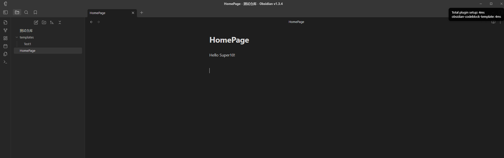

# Obsidian-Codeblock-Template

一个可以把 Code Block 的内容重复利用模板插件！

## 使用

### 设置

设置模板的声明路径，默认路径为根目录的`templates`。


### 基本使用

创建模板

````markdown
```pack-source a
# This is pack-source!
```
````

使用模板

````markdown
```pack-view a

```
````


### 插值

可以在创建模板时使用`$.{}`来定义变量，在使用时传入变量。

````markdown
```pack-source test1
Hello $.{name}！
```
````

通过`key = value`或`key = "value"`来定义变量。**注意：为了方便存储，key 要符合标识符定义规则[^1]**

````markdown
```pack-view test1
name = "Super10"
```
````



## 配合其他插件使用

### dataview

`````
````pack-source dv
```dataview
LIST FROM "$.{path}"
```
````
`````

### tasks

`````markdown
````pack-source test3
```tasks
not done
due after $.{date}
```
````
`````

---

[^1]: 标识符可由三类字符：字母、下划线、数字组成；标识符只能由字母或下划线开头
