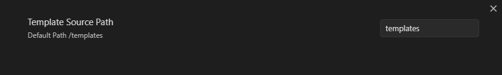
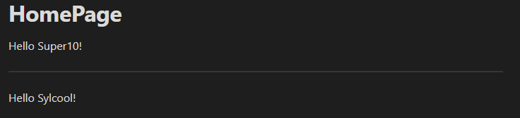
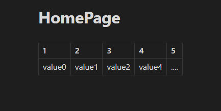
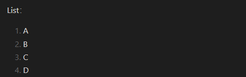

# Obsidian-Codeblock-Template

[简体中文](./README.md)|[English](./README_EN.md)

An Obsidian template plugin that can reuse the content of a Code Block in any note!

- [x] [Template Variables](#interpolation): you can change the template content according to the variables passed in. —— June 4, 2023
- [x] [bulk anonymous variables](#anonymous-variable): multiple values separated by `,` can be passed in to avoid naming too many variables. (CSV-like syntax) —— June 6, 2023
- [x] [array loop variable](#Array): array type with value `[1,2,3,4]` that can loop through the contents of the row. —— June 12, 2023
- [x] Input Tip: enter `...` or **\`\`\`pack-view** where you need to insert the template, and press the space to automatically complete the complete template. —— June 14, 2023

## Install

This plugin has not been uploaded to the Obsidian plugin repository yet, so you need to install it manually.

1. Download `main.js` and `manifest.json` via **release** latest on the right.
2. Create a new folder `codeblock-template` in your plugin directory (.obsidian/plugins) and put the main.js and manifes.json files into this folder.

## Use

### Settings

Set the template storage path, the default path is `templates` in the root directory.



### Basic usage

**Create templates**

````markdown
```pack-source a
# This is pack-source!
```
````

Note: It has to be created under the path specified by `Template Source Path` in the settings to be valid.

**Using Templates**

````markdown
```pack-view a

```
````


### Interpolation

You can use `$.{}` to define variables and pass them in when they are used.

````markdown
```pack-source test1
Hello $.{name}!
```
````

Define variables by `key = value` or `key = "value"`. The template can be reused multiple times.
**Note**: For storage purposes, the key should conform to the identifier definition rule [^1].

````markdown
```pack-view test1
name = "Super10"
```

---

```pack-view test1
name = "Sylcool"
```
````




#### Anonymous Variable

The prefix of anonymous variables can be customized by setting the default to `anonymous_var_`。

**Note**: For storage purposes, the key should conform to the identifier definition rule [^1].

**Create templates**

````markdown
```pack-source test_anonymous
| 1                   | 2                   | 3                   | 4                   | 5                   |
| ------------------- | ------------------- | ------------------- | ------------------- | ------------------- |
| $.{anonymous_var_0} | $.{anonymous_var_1} | $.{anonymous_var_2} | $.{anonymous_var_3} | $.{anonymous_var_4} |
```
````

**Using Templates**

````markdown
```pack-view test_anonymous
value0,value1,value2,value4,....
```
````



#### Array
**Create templates**
````markdown
```pack-source test_loop
List：
1. $.{a}
```
````

**Using Templates**
````markdown
```pack-view test_loop
a = [A,B,C,D]
```
````


## Use with other plugins

### dataview

`````markdown
````pack-source dv
```dataview
LIST FROM "$.{path}"
```
````
`````

### tasks

`````markdown
````pack-source tasks
```tasks
not done
due after $.{date}
```
````
`````

## Next stage

-   [ ] Can read local `.csv .json` file data

[^1]: identifiers can consist of three types of characters: letters, underscores, and numbers; identifiers can only start with letters or underscores
